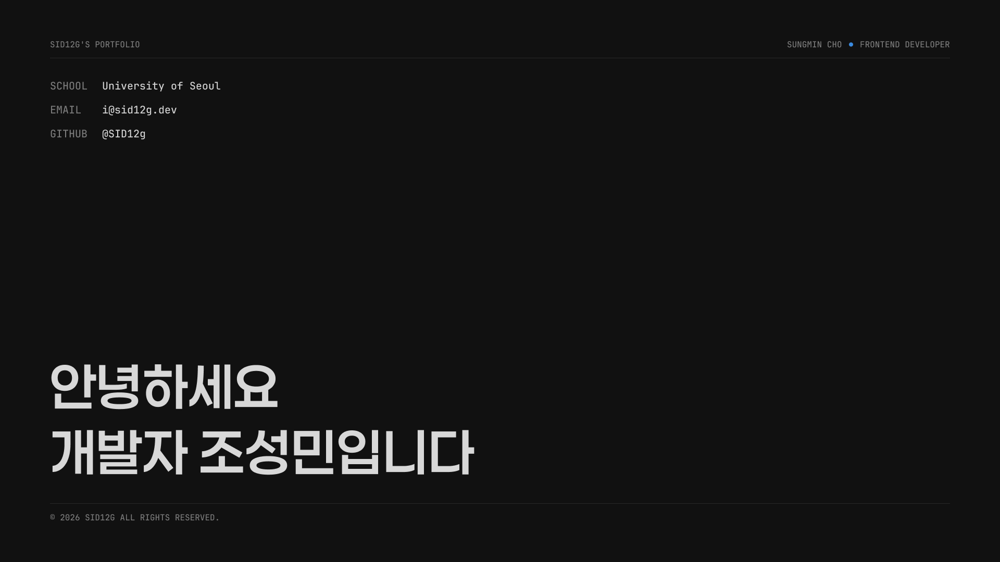

# sid12g.dev

조성민의 개인 페이지 입니다.

<a target="_blank" href="https://sid12g.dev">
  
</a>

## 기술 스택

| 역할          | 스택                                                                                                                                                                                               |
| ------------- | -------------------------------------------------------------------------------------------------------------------------------------------------------------------------------------------------- |
| 프레임워크    |                                                                                            |
| 기본 언어     |                                                                                   |
| 스타일링      |                                                                               |
| 패키지 매니저 |                                                                                                     |
| 버전 컨트롤   |   |
| 배포          |                                                                                               |

## 프로젝트 실행

```bash
pnpm dev
```
